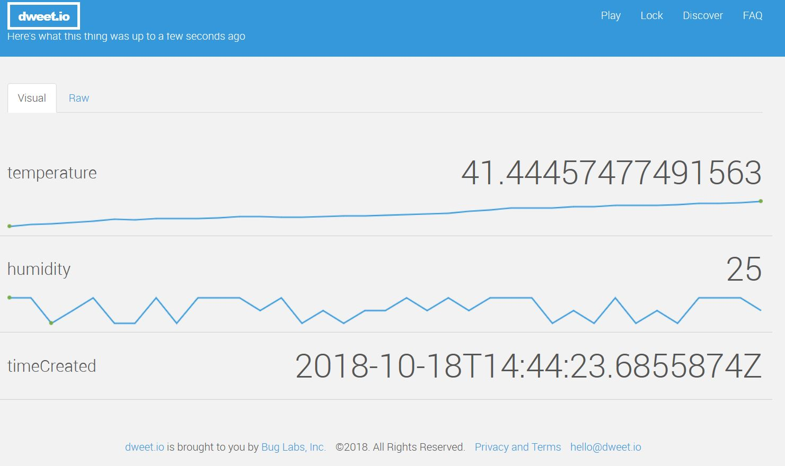
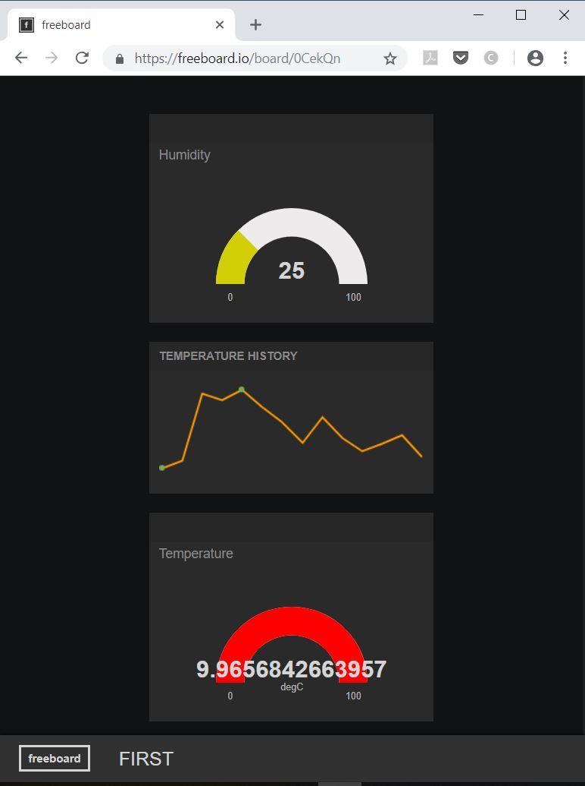

# Azure IoT Edge Dweet module

A super easy way to get real time visualization of telemetry data on Azure IoT Edge devices by using [Dweet.io](https://dweet.io).

This is a simple [Azure IoT Edge](https://azure.microsoft.com/en-us/services/iot-edge/) sample custom module, that forwards all messages sent to it to the [Dweet.io](https://dweet.io) service for displaying it as time-series data. Currently only sending 'flat' json message payloads is supported:

```
{
    "temperature" : 12.21,
    "humidity" : 35.22
}
```
Sample shown on Dweet.io



Additionally [Freeboard.io](http://freeboard.io/) can be used to create a complete dashboard for visualization.



Only messages sent to 'input1' of the module will be forwarded accordingly. As an example this project contains a temperature simulator module, too, that can be used for testing.

Pre-built images are available on DockerHub:
* Dweet module: **jmayrbaeurl/azureiotedge-dweetio:0.0.1-amd64**
* Temperature and humidity simulation module: **jmayrbaeurl/azureiotedge-temphumsimulator:0.0.1-amd64**

## Configuration

### Dweet thing name
The thing name used on the [Dweet.io](https://dweet.io) web portal can be configured by either specifying it as the first argument of the module or by setting the environment variable DWEETTHINGNAME. If neither is specified, the name of the current Azure IoT Hub instance will be used. Anyway you can always find the used thing name in the docker log of the module.

### Route for Azure IoT Edge

Sample:
```
        "routes": {
          "sensorToDweetModule": "FROM /messages/modules/TemperatureSimulatorModule/outputs/* INTO BrokeredEndpoint(\"/modules/DweetModule/inputs/input1\")",
          "TemperatureSimulatorModuleToIoTHub": "FROM /messages/modules/TemperatureSimulatorModule/outputs/* INTO $upstream"
        },
```